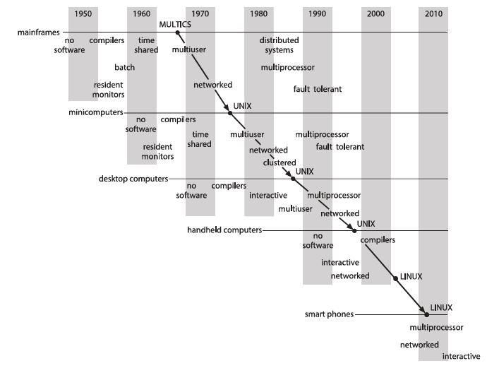

# Appendix A - Operating System Concepts (10th Edition, 2018) oleh Abraham Silberschatz.

    Note : Pengerjaan tugas ini didasarkan pada dokumen yang berjudul Appendix-A (Influential Operating Systems)
           yang sudah diberikan oleh Bapak ( Dr. Ferry Astika Saputra ST, M.Sc ) serta berikut adalah rangkumannya.

</img>

## 1. Pendahuluan Sistem Operasi

Sistem operasi adalah perangkat lunak yang berfungsi sebagai perantara antara perangkat keras komputer dan pengguna. Tujuan utama sistem operasi adalah untuk mengelola sumber daya perangkat keras dan menyediakan lingkungan yang memungkinkan pengguna menjalankan program dengan efisien.

### Fungsi utama sistem operasi:

- Manajemen Proses – Mengelola eksekusi program, penjadwalan CPU, dan komunikasi antar-proses.
- Manajemen Memori – Mengalokasikan dan membebaskan memori untuk program yang sedang berjalan.
- Manajemen Penyimpanan – Mengatur file dan sistem direktori dalam penyimpanan sekunder.
- Manajemen Perangkat I/O – Mengontrol operasi perangkat input dan output.
- Keamanan dan Proteksi – Menyediakan mekanisme keamanan untuk mencegah akses tidak sah.

Sistem operasi modern dapat dikategorikan berdasarkan cara kerjanya, seperti batch processing, time-sharing, real-time systems, dan distributed systems.

 
 
 

## 2. Manajemen Proses

Proses adalah program yang sedang dieksekusi. Sistem operasi bertanggung jawab untuk mengelola eksekusi proses, termasuk penjadwalan dan komunikasi antar-proses.

### Komponen Proses

- PCB (Process Control Block) – Struktur data yang menyimpan informasi tentang status proses.
- Context Switching – Proses menyimpan dan memuat kembali status proses saat berpindah eksekusi.
- Penjadwalan Proses – Termasuk Short-term scheduler, Medium-term scheduler, dan Long-term scheduler untuk mengatur eksekusi program.

### Terdapat tiga metode utama dalam penjadwalan proses:

- FCFS (First-Come, First-Served) – Proses dieksekusi berdasarkan urutan kedatangan.
- SJF (Shortest Job First) – Proses dengan waktu eksekusi terpendek akan dijalankan lebih dulu.
- Round Robin – Setiap proses mendapatkan jatah waktu eksekusi dalam siklus.

Selain itu, sistem operasi juga mendukung konkurensi dan komunikasi antar-proses (IPC) melalui shared memory atau message passing.

 
 
 

## 3. Manajemen Memori

Memori utama digunakan untuk menyimpan program dan data selama eksekusi. Sistem operasi bertugas mengelola alokasi memori, termasuk strategi pengalokasian dan teknik memori virtual.

### Teknik Alokasi Memori:

- Partisi Statis – Memori dibagi menjadi blok tetap, yang bisa menyebabkan fragmentasi.
- Partisi Dinamis – Memori dialokasikan secara fleksibel sesuai kebutuhan proses.
- Paging – Memori dibagi menjadi blok kecil bernama page, dan setiap proses mendapatkan page sesuai kebutuhannya.
- Segmentation – Memori dibagi berdasarkan segmen logis seperti kode, data, dan stack.

### Memori Virtual:

Teknik ini memungkinkan proses menggunakan lebih banyak memori daripada kapasitas fisik yang tersedia dengan cara menyimpan sebagian data di disk. Teknik yang digunakan dalam memori virtual meliputi:

- Demand Paging – Hanya page yang dibutuhkan akan dimuat ke memori.
- Page Replacement Algorithms – Seperti FIFO, LRU, dan Optimal Page Replacement untuk menggantikan halaman yang tidak terpakai.

 
 
 

## 4. Manajemen Penyimpanan

Sistem operasi mengatur bagaimana file disimpan, diakses, dan dikelola di dalam sistem penyimpanan sekunder.

### Struktur File dan Sistem Direktori

- Single-Level Directory – Semua file berada dalam satu direktori, mudah tetapi tidak efisien.
- Two-Level Directory – Setiap pengguna memiliki direktori sendiri.
- Tree-Structured Directory – Struktur hierarkis yang memungkinkan pencarian file lebih mudah.
- Acyclic Graph Directory – Menggunakan konsep shortcut (alias) untuk menghindari duplikasi file.
- General Graph Directory – Memungkinkan hubungan antar direktori secara bebas, tetapi memiliki risiko looping.

### Manajemen Disk dan Penjadwalan

- FCFS (First Come First Serve) – Permintaan disk diproses berdasarkan urutan kedatangan.
- SSTF (Shortest Seek Time First) – Memproses permintaan dengan jarak kepala baca/tulis terpendek lebih dahulu.
- SCAN (Elevator Algorithm) – Kepala disk bergerak ke satu arah sampai akhir, lalu kembali ke arah sebaliknya.

 
 
 

## 5. Keamanan dan Proteksi

Keamanan sistem operasi bertujuan untuk melindungi data dan sumber daya sistem dari akses tidak sah.

### Ancaman Keamanan

- Malware (Virus, Worms, Trojan, Ransomware) – Program berbahaya yang menyerang sistem.
- Denial-of-Service (DoS) Attack – Serangan yang membanjiri sistem dengan permintaan palsu.
- Phishing & Social Engineering – Penipuan yang mengecoh pengguna untuk memberikan informasi rahasia.

### Teknik Keamanan

- Autentikasi – Verifikasi identitas pengguna dengan metode seperti password, biometrik, atau two-factor authentication.
- Enkripsi Data – Penggunaan algoritma enkripsi untuk melindungi data dari pencurian.
- Access Control Lists (ACLs) – Pengaturan hak akses berdasarkan pengguna atau grup.