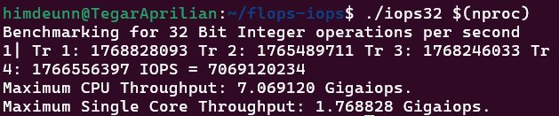
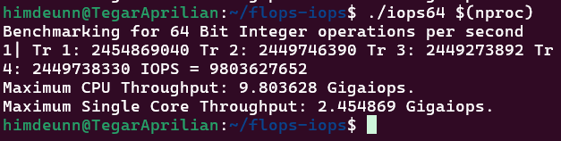
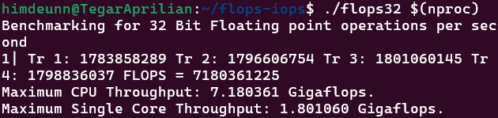
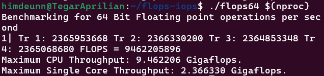

# Pengujian FLOPS dan IOPS pada WSL

## Tujuan Pembelajaran
- Memahami konsep **FLOPS (Floating Point Operations Per Second)** dan **IOPS (Integer Operations Per Second)**.
- Menganalisis performa CPU dalam menangani operasi floating point dan integer.
- Menggunakan WSL (Windows Subsystem for Linux) untuk menjalankan benchmark FLOPS dan IOPS.

---

## Dasar Teori
### 1. **FLOPS (Floating Point Operations Per Second)**
FLOPS adalah satuan untuk mengukur kecepatan pemrosesan angka dalam format floating-point. FLOPS sering digunakan untuk mengukur performa komputer dalam aplikasi ilmiah dan perhitungan numerik.

### 2. **IOPS (Integer Operations Per Second)**
IOPS adalah satuan yang mengukur jumlah operasi integer yang dapat dilakukan CPU dalam satu detik. Performa IOPS sangat penting dalam aplikasi yang membutuhkan banyak operasi aritmatika integer seperti enkripsi dan pengolahan data besar.

### 3. **Windows Subsystem for Linux (WSL)**
WSL adalah fitur pada Windows yang memungkinkan pengguna menjalankan distribusi Linux tanpa harus menginstal sistem operasi Linux secara terpisah. Dengan WSL, kita dapat menjalankan berbagai alat Linux, termasuk FLOPS dan IOPS benchmark.

---

## Langkah Pengujian FLOPS dan IOPS pada WSL

### **1. Pastikan WSL Terinstal**
Pastikan Anda telah menginstal WSL dengan distribusi Linux seperti Ubuntu. Jika belum, instal WSL dengan perintah berikut:

```powershell
wsl --install
```

### **2. Buka Terminal WSL**
Buka terminal WSL melalui menu Start atau aplikasi terminal pilihan Anda.

### **3. Perbarui Paket dan Instal Dependensi**
```bash
sudo apt update && sudo apt install -y build-essential
```

### **4. Clone Repository FLOPS-IOPS**
```bash
git clone https://github.com/ferryastika/flops-iops.git
cd flops-iops
```

### **5. Build Program Benchmark**
```bash
make
```

### **6. Jalankan Pengujian FLOPS dan IOPS**
Jalankan benchmark dengan jumlah thread sesuai dengan jumlah core CPU Anda:
```bash
./iops32 $(nproc)
./iops64 $(nproc)
./flops32 $(nproc)
./flops64 $(nproc)
```

---

## Analisa
- **IOPS Benchmark**: Mengukur jumlah operasi integer yang dapat diproses CPU dalam satu detik.
- **FLOPS Benchmark**: Mengukur jumlah operasi floating point yang dapat dilakukan CPU dalam satu detik.
- **Hasil Pengujian** dapat digunakan untuk membandingkan performa CPU dengan spesifikasi yang berbeda.
- **Semakin tinggi nilai FLOPS dan IOPS**, semakin cepat CPU dalam menangani operasi aritmetika dan komputasi ilmiah.

Contoh hasil pengujian pada Intel(R) Core(TM) i3-1005G1:

</img>

```bash
./iops32 4
Benchmarking for 32 Bit Integer operations per second
1| Tr 1: 1768828093 Tr 2: 1765489711 Tr 3: 1768246033 Tr 4: 1766556397 IOPS = 7069120234
Maximum CPU Throughput: 7.069120 Gigaiops.
Maximum Single Core Throughput: 1.768828 Gigaiops.
```

</img>

```bash
./iops64 4
Benchmarking for 64 Bit Integer operations per second
1| Tr 1: 2454869040 Tr 2: 2449746390 Tr 3: 2449273892 Tr 4: 2449738330 IOPS = 9803627652
Maximum CPU Throughput: 9.803628 Gigaiops.
Maximum Single Core Throughput: 2.454869 Gigaiops.
```

</img>

```bash
./flops32 4
Benchmarking for 32 Bit Floating point operations per second
1| Tr 1: 1783858289 Tr 2: 1796606754 Tr 3: 1801060145 Tr 4: 1798836037 FLOPS = 7180361225
Maximum CPU Throughput: 7.180361 Gigaflops.
Maximum Single Core Throughput: 1.801060 Gigaflops.
```

</img>

```bash
./flops64 4
Benchmarking for 64 Bit Floating point operations per second
1| Tr 1: 2365953668 Tr 2: 2366330200 Tr 3: 2364853348 Tr 4: 2365068680 FLOPS = 9462205896
Maximum CPU Throughput: 9.462206 Gigaflops.
Maximum Single Core Throughput: 2.366330 Gigaflops.
```

---

## Kesimpulan
- FLOPS dan IOPS adalah metrik penting dalam mengevaluasi performa CPU.
- WSL memungkinkan pengguna menjalankan benchmark sistem Linux langsung di Windows.
- Pengujian ini memberikan wawasan tentang kemampuan komputasi numerik CPU untuk berbagai kebutuhan aplikasi.
- Hasil yang diperoleh dapat digunakan sebagai bahan analisis untuk memilih prosesor yang sesuai dengan kebutuhan spesifik.

---

**Referensi:**  
- [Repository FLOPS-IOPS](https://github.com/ferryastika/flops-iops)

