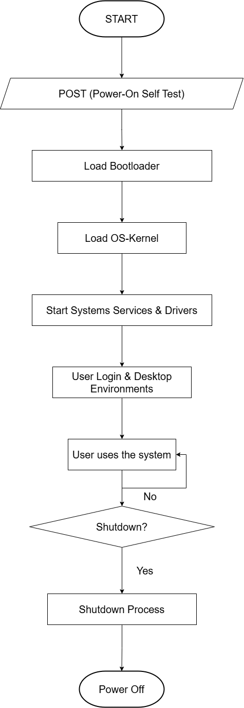

# Flowchart Sistem Operasi Laptop Bekerja dari Booting hingga Shutdown

</img>

### 1. Menyalakan Laptop (Power On) 
Ketika kamu menekan tombol **Power**, laptop mulai hidup. Ini adalah titik awal dari seluruh proses.  

### 2. Pemeriksaan Awal (POST - Power-On Self Test) 
Laptop langsung memeriksa apakah perangkat kerasnya dalam kondisi baik, seperti **RAM, CPU, dan keyboard**. Kalau ada masalah, biasanya muncul beep code atau pesan error di layar.  

### 3. Mencari Bootloader  
Kalau semuanya aman, sistem mencari **bootloader** di penyimpanan (HDD/SSD). Bootloader ini bertugas untuk menemukan sistem operasi yang akan dijalankan.  

### 4. Memuat Kernel OS
Bootloader menemukan **kernel sistem operasi** dan memasukkannya ke dalam **RAM**. Kernel ini adalah inti dari sistem operasi, yang mengontrol segala sesuatu di laptop.  

### 5. Menjalankan Layanan Sistem & Driver **  
Kernel mulai mengaktifkan berbagai **driver dan layanan sistem**, seperti koneksi internet, suara, dan tampilan grafis. Ini seperti “pemanasan” sebelum laptop siap digunakan.  

### 6. Login ke Sistem 
Sekarang kamu bisa masuk ke sistem dengan **username dan password**. Setelah berhasil, tampilan desktop akan muncul dan laptop siap digunakan.  

### 7. Menggunakan Laptop  
Kamu bisa membuka aplikasi, browsing, atau mengerjakan tugas. Sistem operasi terus bekerja di belakang layar untuk mengelola **CPU, RAM, dan penyimpanan**.  

### 8. Apakah Mau Shutdown? 
Ketika selesai menggunakan laptop, kamu punya dua pilihan:  
**Ya** → Proses shutdown dimulai.  
**Tidak** → Laptop tetap menyala, dan kamu bisa lanjut bekerja.  

### 9. Proses Shutdown  
Jika memilih shutdown, sistem mulai menutup semua aplikasi, menyimpan pekerjaanmu, dan mematikan layanan sistem.  

### 10. Laptop Mati (Power Off) 
Semua komponen perangkat keras dimatikan, dan laptop benar-benar mati. Selesai!  

---

### Kesimpulan: 
- **Oval** → Awal atau akhir proses.  
- **Paralelogram** → Input/output sistem.  
- **Persegi panjang** → Proses yang terjadi.  
- **Belah ketupat** → Keputusan yang harus diambil.  