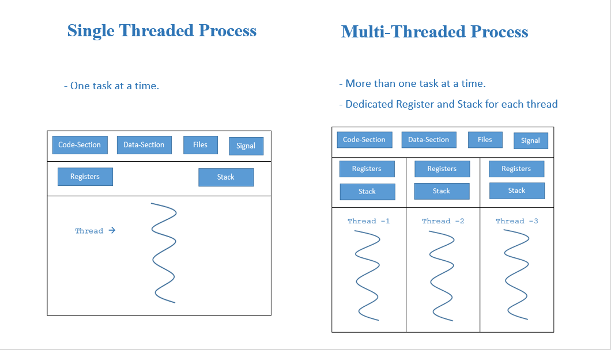

# Single VS Multi Thread

```
Konsep single thread dan multithread sangat penting dalam pemrograman, terutama ketika membahas efisiensi dan performa aplikasi. Single thread berarti program hanya memiliki satu alur eksekusi. Dalam sistem ini, setiap tugas atau proses harus diselesaikan satu per satu. Jika satu proses memakan waktu, maka proses lainnya harus menunggu hingga proses tersebut selesai. Konsep ini sederhana dan mudah diimplementasikan, tetapi kurang efisien untuk aplikasi yang memerlukan banyak proses secara bersamaan seperti game, aplikasi real-time, atau server web.

Sebaliknya, multithread memungkinkan program untuk menjalankan beberapa alur eksekusi secara bersamaan (paralel). Setiap thread dapat menjalankan tugas berbeda secara simultan, yang membuat pemrosesan menjadi lebih cepat dan efisien, terutama pada prosesor multi-core. Namun, penerapan multithread lebih kompleks karena membutuhkan pengelolaan sinkronisasi antar thread agar tidak terjadi konflik data atau race condition.
```

```
Berikut adalah ilustrasi perbandingan antara single thread dan multithread:
```

